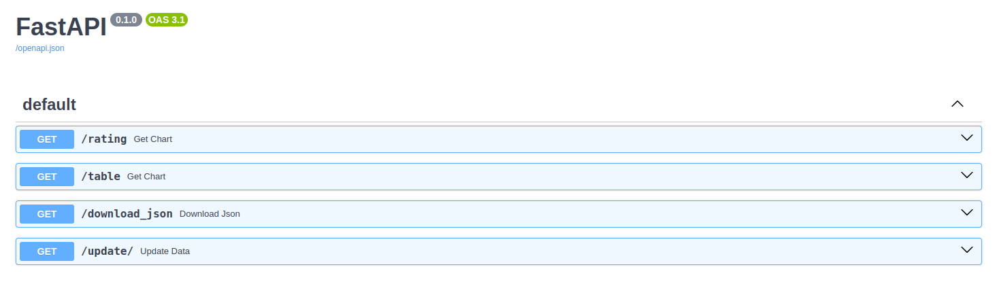
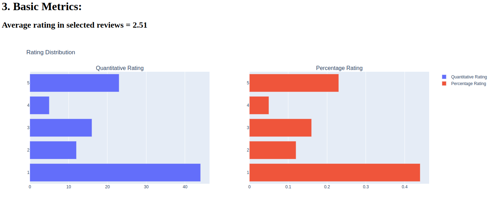
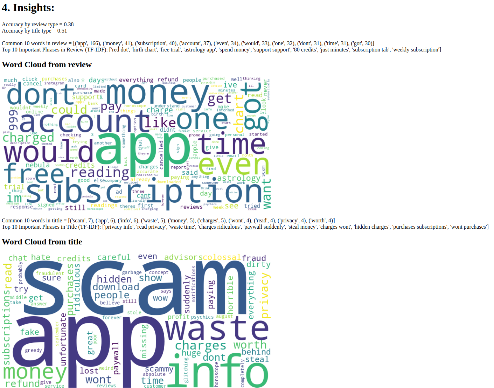
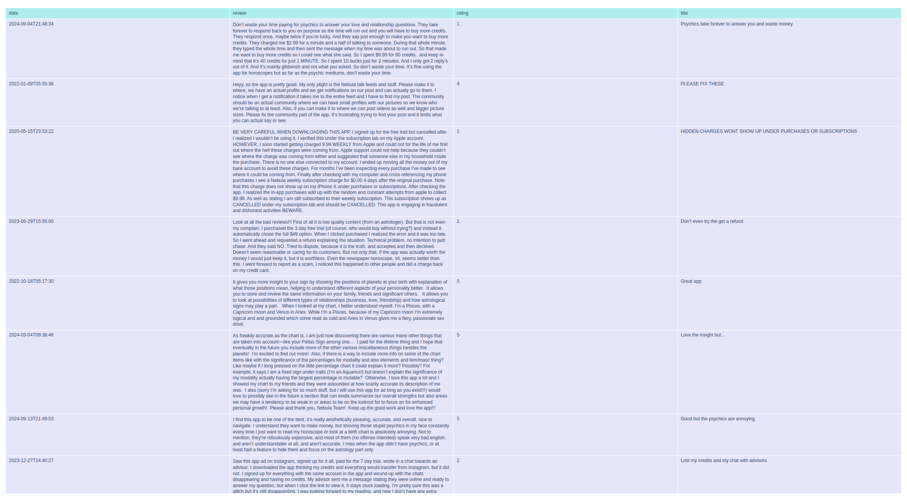

# app-store-analyzer
This is a test project for app store scraping, based on basic Rest API, statistics, and NLP skills.

## Main goals:
* Collecting data (likely web scraping or API usage).
* Cleaning and processing the collected data.
* Analyzing it to generate insights.
* Presenting the insights in a meaningful way, such as through visualizations.
## To start project
Clone it, create environment and install requirements 
```
git clone git@github.com:MaksMaib/app-store-analyzer.git
cd app-store-analyzer/
python3 -m venv .venv
source .venv/bin/activate
```
```
 pip install -r requirements.txt
```

```
python main.py 
```
The Python library was used `app_store_scraper` for data scraping. Since it was the easiest and fastest in terms of developing a solution.

The data was then converted into a `pandas dataframe`. This library is easy to use, has extensive functionality for data analysis and manipulation, and is well suited for processing medium-sized tabular data.
Data cleaning was performed using this library (checking for empty cells, NaN, etc.)
It was also used to calculate basic statistics.

Feedback processing was performed using the following approaches:
* Sentiment analysis

Text preprocessing and review classification was performed with [NLTK](https://www.nltk.org/) library.

Common words were found by calculating the word repetition rate
Common phrases was calculated by using TF-IDF technique. 


Such approaches were chosen due to the desire to make it as easy as possible in terms of computational complexity. So that the chosen approach could be run on any device.

In case of improvement, I would advise using a BERT-based model for sentiment analysis. And additionally transform the reviews into a vector representation and try to cluster them in order to better assess user problems.

# Report showcasing
Developed pipeline contain several endpoints 



## Rating endpoint
contain selected app (by default `Nebula`) metric and insights 
Sentiment Analysis and common words/phrases was calculated separately for reviews and titles





## Table endpoint

Contain raw data for checking



## download_json

Provide ability to download json file with datasource


## update

Provide ability select different app from App Store

for example
`http://0.0.0.0:8000/update/?app_name=calendar&app_id=1108185179` provide information about calendar
